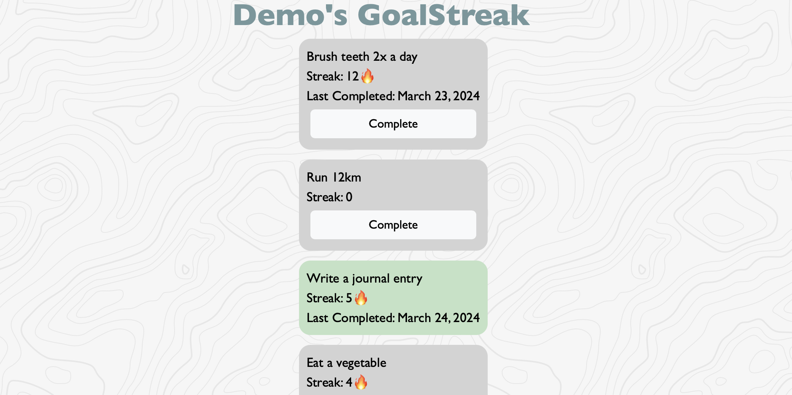

  <h1>GoalStreak</h1>

**GoalStreak** is a peer-pressured web application to create daily goals and stick to them!
View your friends' goals and streaks and hold each other accountable on your self-improvement journeys!

To use GoalStreak:
- create a username and passcode to sign up
- add as many goals as you'd like
- mark each goal as you complete them each day to build up your goal streaks!
- share your personal GoalStreak profile link with friends to view each others' progress

[Click here to visit the published website!](https://zingy-cuchufli-9e28d9.netlify.app)

  
   
  <i>Typical use case to track goals, habits, and more!</i>

